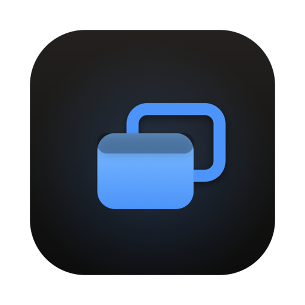
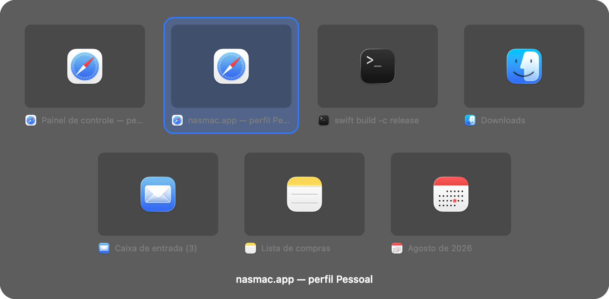

<div align="center">



# AltTab

**The ⌥ Tab the Mac should have had: one window at a time, with previews.**

[nasmac.app](https://nasmac.app) · [Português](README.md) · [Download](https://nasmac.app/downloads/AltTab.dmg)



</div>

---

Free, no account, no ads, no paid tier.

Hold ⌥ and press Tab. Up comes a grid of **every open window** — not one pile per app. Tab moves forward, ⇧Tab back, let go of ⌥ and you are there. Same as Windows.

## Why it exists

⌘Tab on the Mac switches between *applications*. If you have two Chromes open, one for work and one for your personal profile, it shows you **one** Chrome. Getting to the right window means ⌘Tab, then ⌘`, then guessing.

AltTab shows both, with each window's own title and a preview of what is in it.

## How it behaves

Every row is a real window, in the order they are stacked on screen — so a single ⌥Tab takes you back to the window you just came from.

- **A preview of each window**, captured live and always at the same size.
- **Minimized windows** are included (you can turn that off), confirmed with the app that owns them — the system's raw list mixes in extension popups and helper windows nobody wants to see.
- **⇧Tab** goes back, **arrows** navigate, **Esc** cancels, **Enter** confirms, **click** picks directly.
- **Configurable shortcut**: ⌥ Tab out of the box, or ⌃ or ⌘ with a key of your choosing.

## Install

Download the [DMG](https://nasmac.app/downloads/AltTab.dmg) — and **don't open it yet**.

macOS blocks the downloaded file, because the app is not notarized by Apple yet: notarization requires the paid developer program. Before opening it, run this in Terminal:

```bash
xattr -dr com.apple.quarantine ~/Downloads/AltTab*.dmg
```

Now open the .dmg and drag the app to your Applications folder.

## The two permissions

On first launch AltTab asks for two things and explains each one:

- **Accessibility** — required. It is what lets AltTab see ⌥ Tab and bring the window you picked to the front. Without it the app does nothing.
- **Screen Recording** — optional. It draws the previews and reads window titles. Without it you get app icons and names, and everything else still works.

### I switched it on and it still says no

There is an annoying explanation, and it is worth knowing: **macOS ties the permission to the exact copy of the app**, by the hash of its binary. A new version arrives as a stranger, while the switch in Settings stays on, pointing at the old copy.

When it happens: in System Settings → Privacy & Security → Accessibility, select AltTab, press **−** to remove it, then add it again with **+**. The app says so on screen when it detects the situation.

An Apple Developer ID certificate fixes this for good, because then the permission belongs to the app rather than to one build. It is on the list.

## Build from source

You only need Apple's Command Line Tools — no full Xcode install.

```bash
git clone https://github.com/vprotti/alttab.git
cd alttab
./scripts/build.sh
```

You get `dist/AltTab.app`, universal (Apple Silicon and Intel). For the installer, `./scripts/dmg.sh`.

Handy while changing the code — it prints exactly what the switcher can see, along with the state of both permissions:

```bash
./dist/AltTab.app/Contents/MacOS/AltTab --selftest-windows
```

## How it is put together

The shortcut could not be a Carbon hot key: those tell you when a key goes **down**, and ⌥Tab is defined by the modifier coming **up**. So it is a `CGEventTap` watching `flagsChanged`, which is also the only way to swallow the Tab so it never reaches the app in front.

The window list crosses two sources. `CGWindowListCopyWindowInfo` gives the stacking order and each window's id, but returns well over a hundred entries — shadows, autofill services, widgets. What separates a real window is its owner being an app with a Dock icon. And the Accessibility API is the only public way to actually focus a window, as well as to confirm which ones are genuinely minimized.

Joining the two means translating a `CGWindowID` into an `AXUIElement`, which the public API does not offer. `_AXUIElementGetWindow` does, and is resolved at runtime — if Apple ever removes it, the app falls back to matching on title and position instead of breaking.

Previews come from ScreenCaptureKit on macOS 14+ and the older API on 13, captured **after** the grid is already on screen, one at a time — grabbing them all up front would delay the panel by exactly the amount that makes a switcher feel broken.

```
Sources/AltTab/WindowList.swift      which windows exist
Sources/AltTab/AXWindows.swift       the bridge to Accessibility
Sources/AltTab/Hotkey.swift          hold, cycle, release
Sources/AltTab/SwitcherPanel.swift   the grid
Sources/AltTab/Thumbnails.swift      the previews
```

No external dependencies.

## Privacy

Everything stays on your Mac. No server, no account, no telemetry. Previews are drawn on screen and never leave the computer — they are not written to disk and not sent anywhere.

## Contributing

Bug, idea or question: [open an issue](https://github.com/vprotti/alttab/issues). Pull requests are welcome — please read [CONTRIBUTING](CONTRIBUTING.md) first.

If a window shows up that should not be in the list, or one is missing that should, the output of `--selftest-windows` in an issue helps a lot.

If AltTab saved you some time, a ⭐ on the repo helps other people find it. Takes a second and costs nothing.

If you would rather give back another way, I accept Bitcoin — the app stays free either way:

```
bc1qs27wszjtkhku08nkmth4ctykyk9pa2nrfa2nlw
```

## License

[MIT](LICENSE). Use it, change it, ship it, including commercially.

Written from scratch. There is another open-source app called AltTab, under the GPL, unrelated to this one — no code was taken from it.

---

<div align="center">
Built by <a href="https://viniciusprotti.com.br">Vinicius Protti</a> · <a href="https://nasralla.com.br">Nasralla Serviços Digitais</a><br>
More free Mac apps at <a href="https://nasmac.app"><strong>nasmac.app</strong></a>
</div>
